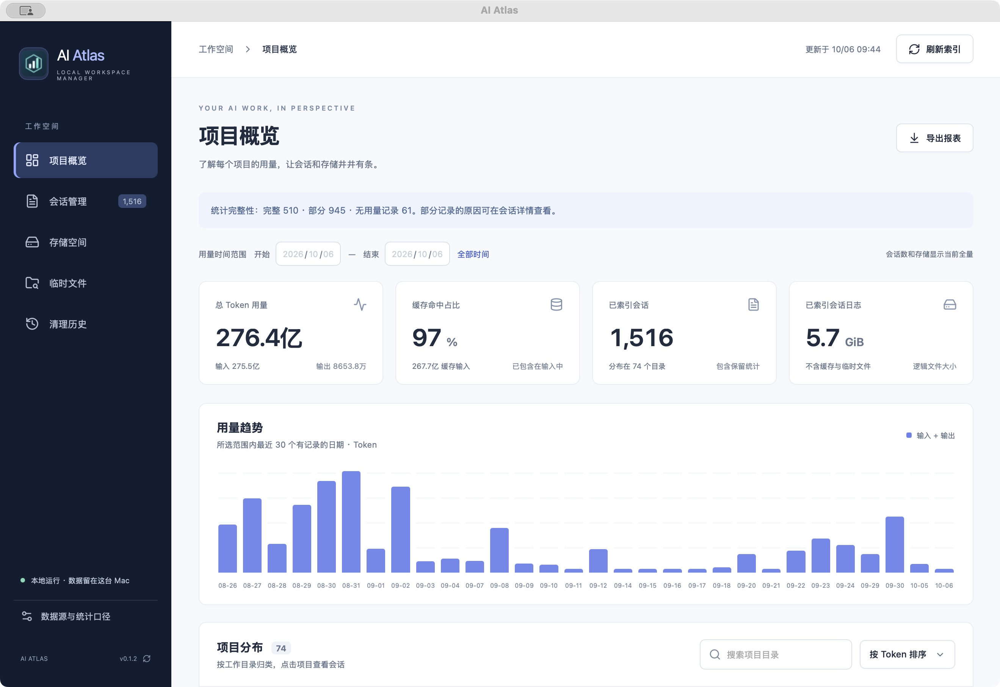
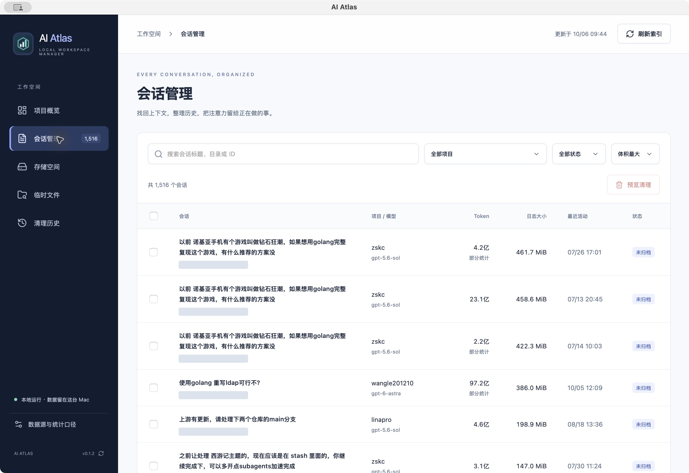
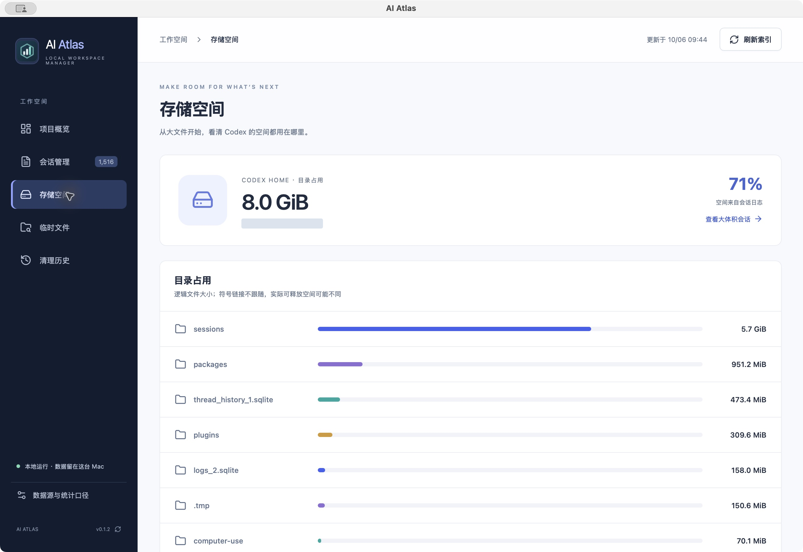
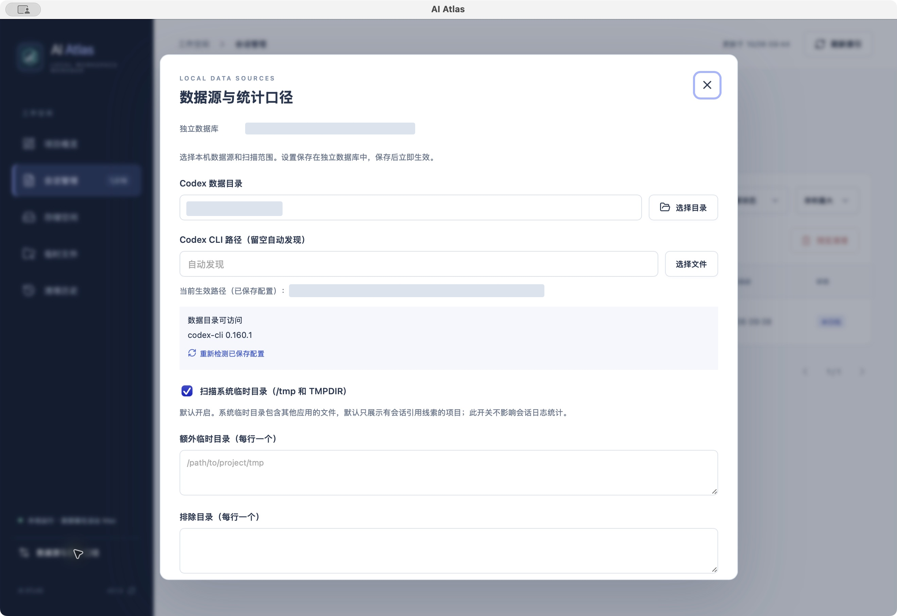

# AI Atlas

本地 AI 编程工具的项目、Token 用量、会话和存储管理工具。当前支持 **Codex**，后续可扩展 Claude Code 等数据源；本次更名不代表已支持其他工具。使用 **Wails 3.0.0-beta.27 + Vue 3 / TypeScript + Go 1.25+ + SQLite**，优先支持 macOS。

## 功能

- **项目看板**：按工作目录汇总输入、缓存输入、输出、总 Token；日期筛选、最近 30 个有记录日期的趋势、JSON 导出。
- **会话管理**：搜索标题/路径/ID，项目和状态筛选，按时间/体积/Token 排序，每页 50 条；默认显示最近消息、每页 50 条、会话内搜索、一键复制继续会话命令到系统剪贴板、归档/取消归档。复制反馈只在弹窗显示，10 秒后自动消失。
- **存储分析**：扫描 Codex Home 各条目，按逻辑文件大小排序，定位大体积会话。
- **临时文件**：扫描 Codex 临时目录、`/tmp`、系统 `TMPDIR`；关联工具命令/输出中的绝对路径，显示会话与项目线索，未知归属单列。
- **清理预览**：最多 50 项；检查路径、符号链接、最近修改及 `lsof` 占用，执行前再次校验。会话通过官方 `codex delete --force <UUID>` 删除；macOS 临时文件移入废纸篓并记录原路径。会话默认压缩备份后清理，可在清理历史恢复；关闭备份时才执行永久删除。
- **历史用量留存**：独立 SQLite 索引，源日志移除后保留用量统计。扫描按文件大小与修改时间跳过未变化文件，变化文件流式重新解析。

扫描和统计不上传日志；手动检查更新时访问 GitHub。不会读取认证文件内容。存储扫描只读取文件元数据；会话内容在打开预览时读取。

## 功能预览

以下截图通过 Computer Use 从 macOS 桌面应用实际截取；本机路径与会话标识已遮盖。

### 项目概览

查看总 Token、缓存命中占比、会话日志体积和用量趋势。



### 会话管理

按日志体积从大到小排列多个会话，快速定位数百 MiB 的大日志；支持搜索、项目筛选和清理预览。



### 存储分析

区分会话日志、缓存和插件占用，定位空间消耗来源。



### 数据源与扫描范围

配置 Codex 目录、查看实际 CLI 路径，并选择系统临时目录和排除目录。



## 联系与反馈

使用 AI Atlas 遇到问题，或有功能建议，欢迎扫码添加作者微信交流，添加时请备注 **AI Atlas**。


Bug 和功能需求也可以提交到 [GitHub Issues](https://github.com/wangle201210/ai-atlas/issues)，方便跟踪处理进度。

## 运行

需要 Go 1.25+、Node.js 22.12+、npm、Xcode Command Line Tools。清理/归档需要 Codex CLI；占用检查需要 `lsof`。

```sh
go install github.com/wailsapp/wails/v3/cmd/wails3@v3.0.0-beta.27
export PATH="$(go env GOPATH)/bin:$PATH"
# 在项目根目录运行
wails3 dev
```

构建并打包 Mac 应用：

```sh
wails3 package
open bin/ai-atlas.app
```

首次打开可在左下角「数据源与统计口径」选择数据目录、CLI、额外临时目录与排除目录，然后点击「开始扫描」。系统临时目录（/tmp 和 TMPDIR）默认开启，可在设置中关闭；此选项仅影响临时文件扫描，不影响会话日志统计。CLI 输入框下会显示已保存配置当前使用的可执行文件路径。已有索引会直接展示，手动「刷新索引」同步变化。临时目录较大，单独点击「扫描临时文件」启动分析。扫描可以取消，也可单独重试失败日志；当前文件、耗时、解析/跳过数量和错误会展示在页面顶部；不完整日志保留上一次成功索引。

### 数据位置

| 环境变量 | 默认值 | 用途 |
|---|---|---|
| `CODEX_HOME` | `~/.codex` | 会话及存储扫描根目录 |
| `AI_ATLAS_DB` | `~/.ai-atlas/atlas.sqlite` | Atlas 自己的 SQLite 数据库 |
| `AI_ATLAS_CODEX` | 自动发现 | Codex CLI 的绝对路径，可覆盖 PATH / Homebrew / NVM 查找 |

不改写 Codex 自身 SQLite。归档/删除委托 Codex CLI；首次使用清理前先在预览里核对完整路径。临时文件移入废纸篓后仍占用磁盘，需要用户清空废纸篓才真正释放空间。

### 无桌面窗口的本地模式

```sh
wails3 build
# SQLite 驱动使用 CGO，服务器模式也需要 CGO_ENABLED=1
CGO_ENABLED=1 go build -tags server -o bin/ai-atlas-server .
WAILS_SERVER_HOST=127.0.0.1 WAILS_SERVER_PORT=19427 ./bin/ai-atlas-server
```

浏览器访问 `http://127.0.0.1:19427`。此模式用于本机开发/验证，没有多用户认证，不应暴露到公网。远程服务器上的实例只能访问该服务器的文件。

## README 截图

README 使用 Computer Use 截取的原生桌面窗口图，存放于 `docs/screenshots/`。更新时打开相应功能页，检查可见内容并遮盖个人路径、会话 ID 等信息，再替换图片。

## 测试

```sh
go test -race ./internal/... ./cmd/atlas-index
go vet ./...
# 生成绑定、构建前端和原生程序
wails3 build
# 隔离数据的端到端测试；使用本机 Google Chrome
python3 scripts/create-fixture.py
CGO_ENABLED=1 go build -tags server -o bin/ai-atlas-server .
cd frontend
npm run test:e2e
```

测试数据位于 `.test-data/`，不会读取或删除真实 Codex Home。端到端测试覆盖扫描、项目进入会话、消息预览、清理阻止、日期筛选、报表下载、窄屏和对话框键盘操作。Go 测试覆盖累计/重复/重置计数、分叉去重、历史留存、路径证据、长行/不完整 JSON、符号链接、清理计划和 CLI 删除（使用隔离的假 CLI）。

仅建立索引并导出报表，也可运行：

```sh
go run ./cmd/atlas-index -home "$HOME/.codex" -db "$HOME/.ai-atlas/atlas.sqlite" > report.json
```

## 统计口径与边界

1. 输入包含缓存输入，输出包含推理输出；不重复相加。总量保留日志的 `total_tokens` 增量，旧格式计数可能与分项存在差异。
2. 同一会话累计快照取增量，重复快照只算一次。计数器重置用最后请求用量续计；日志首条若含更早累计，只计最后请求并展示提示。
3. 跨会话以 `turn_id + 累计快照 + 最后请求用量` 去重；重复历史归给创建更早的会话。缺失父日志、缺失 turn ID 或旧版重写行为可能导致归属不完整。独立的压缩 `token_usage_record` 暂未单独纳入。它是本地统计，不是账单审计或额度监控。
4. Token 按请求上下文目录归类；会话数包含与请求上下文关联的会话（跨目录会话可能在多个项目出现），体积按初始目录归类。默认精确目录，不合并 worktree 或相邻仓库。日期使用本机时区，筛选只作用于用量。
5. 同一 ID 的活动/归档副本只索引一份，优先活动日志；所有已移除会话仍保留历史索引，因此“会话数”含仅统计记录。
6. 文件体积是逻辑大小，不推断 APFS 共享块、压缩或实际可回收字节。不会跟随符号链接；权限错误明确显示。
7. 临时文件只通过工具参数/输出里的绝对路径建立关联，不把聊天中的提及视为证据。引用不等于创建证明；相对路径、shell 变量、未记录路径无法可靠追溯。目前针对 macOS 常见路径格式。
8. 临时文件清单在当前进程内缓存，重启需重扫。未知归属、扫描不完整、符号链接、最近 24 小时修改或无法确认空闲的项禁止清理；只处理扫描根目录的直接子项。
9. 默认仅展示有路径线索的临时文件；仅有引用不能进入清理，需要成功创建操作记录或用户明确确认。多项目关联和已知工具共享目录禁止整体清理。用户确认只对当前扫描有效。
10. 清理计划 5 分钟有效且只能用一次。执行前再次检查大小/修改时间及占用；进程占用检查仍无法完全消除外部程序同时访问的竞争窗口。
11. 会话按索引偏移分页读取，每页 50 条，默认最新页；搜索覆盖已索引消息全文，单条显示最多 24,000 字符。不会渲染原始 HTML 或解码图片。日志单行超过 32 MiB 会报告错误。
12. 会话显示完整、部分、无记录三种统计质量。分叉、计数器重置、日志起点缺失和独立压缩记录会标为部分，不将缺失用量简单解释为 0。

## 结构

```text
main.go                    Wails 桌面入口
internal/atlas/
  parser.go                流式 JSONL 解析与引用提取
  store.go                 独立 SQLite 表及去重视图
  service.go               扫描、项目汇总、会话查询
  temp.go                  临时目录和引用关联
  cleanup.go               预览、校验、清理及归档
  codex.go                 CLI 发现与启动
cmd/atlas-index/           只读源数据索引命令
frontend/src/              Vue 中文界面与类型适配
frontend/bindings/         Wails 自动生成绑定
frontend/e2e/              Playwright 端到端测试
```

Wails v3 为 Beta，Go 模块与前端 runtime 固定到同一个版本。默认桌面 UI 不需要另起 Web 服务。

## AI Atlas 自身更新

点击左下角版本号，从 `wangle201210/ai-atlas` 的 GitHub Releases 检查更高的正式版本。发现更新后可查看更新说明，点击「下载更新」，下载及 SHA-256 校验完成后再点击「重启并安装」。下载不会自动重启；安装只替换应用包，不改动独立数据库。

目前自动安装支持 macOS 的完整 `.app`（Apple Silicon / Intel）。浏览器、直接运行的开发二进制及其他系统只能检查并打开 Release 页面。应用所在目录需要可写；扫描进行中会阻止重启。网络失败、GitHub 限流、缺少对应架构附件、缺失或错误校验值会显示错误并允许重试。没有 Release 或没有更高正式版本时显示“当前没有可用更新”。

### 发布更新版本

版本唯一来源是 `internal/buildinfo/VERSION`，页脚从后端读取。用脚本同步打包元数据，避免安装后版本仍显示旧值：

```sh
python3 scripts/version.py 0.1.2
python3 scripts/version.py --check
git add internal/buildinfo/VERSION frontend/package.json frontend/package-lock.json build/config.yml build/darwin/Info*.plist
git commit -m "chore: release v0.1.2"
git tag v0.1.2
git push origin main v0.1.2
```

推送 `v*` 标签会触发 `.github/workflows/release.yml`，为 arm64 / amd64 打包并发布三个必需附件：

- `ai-atlas-darwin-arm64.zip`
- `ai-atlas-darwin-amd64.zip`
- `SHA256SUMS`

每个 ZIP 只包含一个完整 `ai-atlas.app`。更新器仅接受与本机架构匹配的固定附件名称，并强制验证校验值。发布链路通过 GitHub HTTPS 获取资产与校验文件；当前构建为 ad-hoc 签名，未做 Apple Developer ID 签名及公证。

本地检查打包产物（不会发布）：

```sh
wails3 package GOARCH=arm64
python3 scripts/package-release.py --arch arm64
```


## 发布前验证与分发

- `python3 scripts/test-update.py`：在 `.test-data/` 中创建隔离的 v1/v2 应用，执行真实 Wails helper 替换、重新启动，并验证测试数据库保持不变；不替换本机正式应用。
- `scripts/sign-macos.sh`：在具有 **Developer ID Application** 证书和 notarytool keychain profile 的机器上签名、公证、staple。通过 `AI_ATLAS_SIGN_IDENTITY` 和 `AI_ATLAS_NOTARY_PROFILE` 指定配置；脚本不接收或保存明文密码。运行后用 `package-release.py` 重新生成更新包。当前普通构建仍为 ad-hoc 签名。
- 桌面版同一数据库只允许一个应用实例；服务器模式不启用桌面单实例机制。
- 设置中提供脱敏诊断导出与 GitHub 问题反馈入口；详细数据处理说明见 [PRIVACY.md](PRIVACY.md)。
- 项目采用 [MIT 许可证](LICENSE)。

## 恢复与统计限制

会话备份模式先通过 Codex CLI 归档，压缩原始日志并校验，再移除已归档的日志文件；恢复时重新写回日志，并按清理前状态通过 CLI 取消归档，不直接修改 Codex SQLite。若 Codex 自身的归档索引被其他工具永久删除，日志仍可保留，但其原有会话状态可能无法完整恢复。恢复目标已存在时不会覆盖。

消息索引仅保存位置，变化文件仍整文件流式重新解析；尚未实现追加字节级的解析状态续读。独立压缩用量会标为部分统计，尚未单独补计。`provider`、`sourceId`、`key` 已记录到会话元数据，目前仍仅支持单个当前 Codex 数据目录；Claude 数据源尚未接入。
