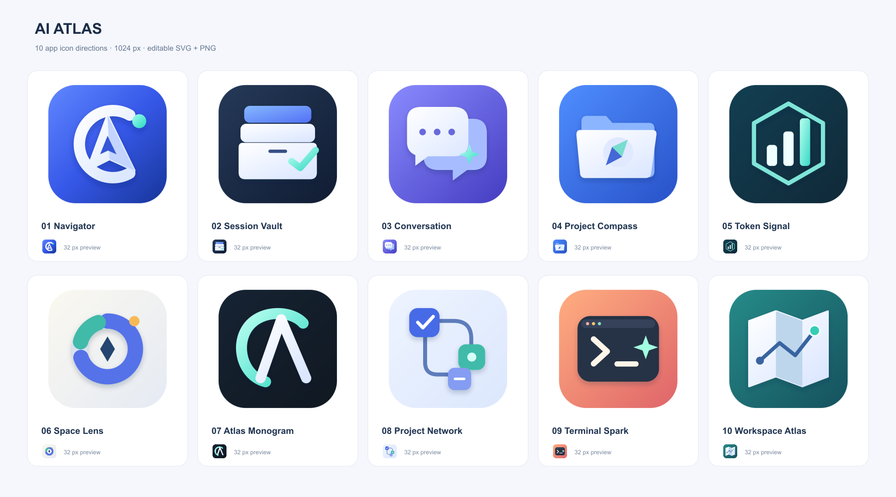

# AI Atlas 图标候选

10 个独立设计，每个提供 1024×1024 PNG、64×64 PNG 和可编辑 SVG。

- **01 导航罗盘**：C 形轨道与 A 形指针，突出 AI Atlas 的品牌识别。 [PNG](01-atlas-navigator.png) · [SVG](01-atlas-navigator.svg)
- **02 会话档案库**：三层归档盒与薄荷绿勾选，强调会话整理与清理。 [PNG](02-session-vault.png) · [SVG](02-session-vault.svg)
- **03 会话轨道**：前后叠放的气泡，代表多会话与上下文。 [PNG](03-conversation-orbit.png) · [SVG](03-conversation-orbit.svg)
- **04 项目指南针**：文件夹与罗盘，直观表达项目目录管理。 [PNG](04-project-compass.png) · [SVG](04-project-compass.svg)
- **05 用量信号**：六边形容器与阶梯柱形图，强调 Token 数据。 [PNG](05-token-signal.png) · [SVG](05-token-signal.svg)
- **06 空间透镜**：环形存储分布与中心指针，适合存储分析定位。 [PNG](06-space-lens.png) · [SVG](06-space-lens.svg)
- **07 字母徽记**：简洁的 C + A 字母组合，小尺寸辨识度高。 [PNG](07-atlas-monogram.png) · [SVG](07-atlas-monogram.svg)
- **08 项目脉络**：连接的项目节点，表达项目、会话和文件的关联。 [PNG](08-project-network.png) · [SVG](08-project-network.svg)
- **09 终端灵光**：终端命令与亮点，偏开发者工具气质。 [PNG](09-terminal-spark.png) · [SVG](09-terminal-spark.svg)
- **10 工作空间地图**：折叠地图和路径，呼应 Atlas 与文件追溯。 [PNG](10-workspace-atlas.png) · [SVG](10-workspace-atlas.svg)

推荐 01（品牌识别）、02（功能直观）或 07（简洁）。

这些为直接制作的矢量图标，没有使用图片生成模型/API。运行 `python3 design/icons/generate-candidates.py` 可重建 02–10 的矢量文件以及所有 PNG 和对比图（需 rsvg-convert）；01 使用已保存的 SVG 源文件。

选定后需同步替换 `build/appicon.svg`、`build/appicon.png` 和 `build/appicon.icon/` 中的默认 Wails 资源，再重新生成 `Assets.car`、ICNS 和 ICO。已选定 05 Token Signal，并应用到桌面图标和侧边栏。
